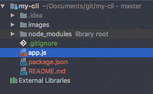
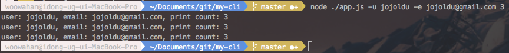
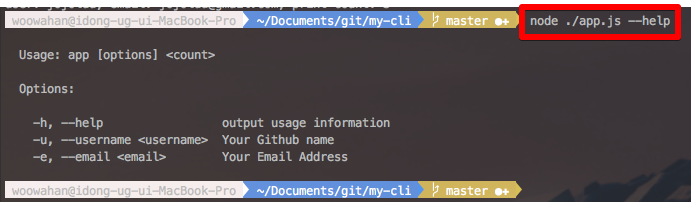

# 나만의 CLI (Command Line Interface) 만들기
마우스로 하는 반복적인 작업이 있을 경우 이를 크게 생각하지 않는 사람이 있고, 이 행동이 귀찮아서 어떻게든 간단하게 해결할 수 있는 방법을 찾는데 더 시간을 쓰는 사람이 있다
이 포스팅은 후자를 위한 이야기입니다.

### 1. npm init
```
npm init
```

### 커맨드 라인 옵션 파싱하기

npm이나 다른 node 패키지들을 사용할 때 보면 여러 옵션을 주면서 스크립트를 실행시키는 것이 기억나시나요? <br/>
이렇게 커맨드라인 입력시 사용되는 옵션을 쉽게 구현하도록 도와주는 패키지가 바로 [commander.js](https://github.com/tj/commander.js)입니다. <br/>
바로 설치와 사용을 해보겠습니다.
```
npm install --save commander
```
그리고 프로젝트 폴더에 app.js 파일을 하나 만들어 아래와 같이 코드를 추가해보겠습니다. <br/>
현재까지의 프로젝트 구조는 아래와 같습니다.




```
var commander = require('commander');

commander
    .arguments('<count>')
    .option('-u, --username <username>', 'Your Github name')
    .option('-e, --email <email>', 'Your Email Address')
    .action(function(count){

        for(var i=0;i<count;i++){
            console.log('user: %s, email: %s, print count: %s', commander.username, commander.email, count);
        }

    })
    .parse(process.argv);

```
commander를 사용하는 코드는 이게 끝입니다. 이렇게 간단한 작성만으로 커맨드라인 옵션을 사용할 수 있게 되었습니다. <br/>
그럼 한번 실행시켜보겠습니다.

```
node ./app.js -u jojoldu -e jojoldu@gmail.com 3

```

결과는!?

 

멋지게 커맨드라인 옵션이 적용된 것을 볼 수 있습니다. <br/>
여기에 추가로 help 옵션의 경우 기본으로 추가됩니다.




### 브라우저 열기
자 이제 주 기능인 브라우저 열기를 해보겠습니다. <br/>
마찬가지로 관련된 npm 패키지를 하나 설치하겠습니다. 이번에 사용할 패키지는 [open](https://github.com/pwnall/node-open) 입니다.

```
npm install --save open
```

