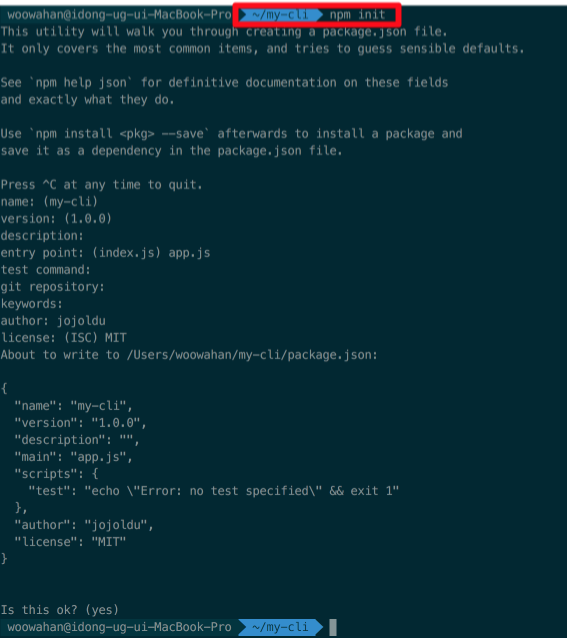
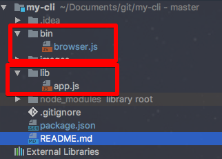
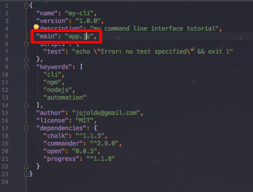
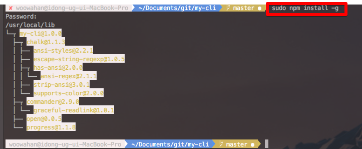
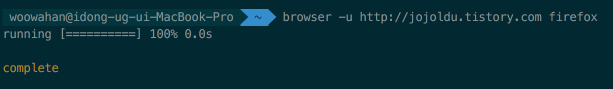

# 나만의 CLI (Command Line Interface) 만들기

최근 들어 반복적인 작업이 생기면 이걸 스크립트로 어떻게 자동화 할 수 있을까 고민하게 되었습니다. <br/>
자동화 스크립트는 쉘스크립트나 파이썬이 대표적으로 떠오르지만, 웹개발을 주로 한 덕분에 자바스크립트에 더 친숙하여 보통은 nodejs가 더 손에 맞는것 같습니다. <br/>
이번 시간은 저처럼 자바스크립트만 아는 개발자 분들에게 nodejs를 이용하여 나만의 CLI를 만들어 귀찮은 일들은 전부 스크립트에 맡기는 이야기를 진행할 예정입니다. <br/>
모든 코드는 [Github](https://github.com/jojoldu/my-cli)에 있으니 전체 코드를 보고싶으시면 참고하시면 될것 같습니다. <br/>
(공부한 내용을 정리하는 [Github](https://github.com/jojoldu/blog-code)와 세미나&책 후기를 정리하는 [Github](https://github.com/jojoldu/review) 를 star 하시면 실시간으로 feed를 받을 수 있습니다.)

## 0. 주제

이번 포스팅에서 만들 스크립트는 터미널에서 url과 브라우저명을 입력하면 해당 브라우저가 열리고 url로 자동이동이 되도록 하는 것입니다. <br/>
아주 간단한 예제이지만, 이를 기반으로해서 다른 필요한 스크립트를 만드시는 기회가 되셨으면 좋겠습니다. <br/>
자 그럼 이제 시작하겠습니다.

## 1. npm init

시작하기 앞서 [nodejs](https://nodejs.org/ko/)가 기본적으로 설치되어 있어야함을 말씀드립니다. (너무당연한걸 얘기한건가요?) <br/>
현재 예제는 6.9.2로 진행중이지만, 다른 버전이라도 크게 문제는 없도록 진행할 예정이니 공식 홈페이지에서 LTS 버전을 바로 받아서 설치하시면 될것 같습니다. <br/>
nodejs 모듈를 만들 것이기 때문에 my-cli이란 이름의 폴더 하나를 생성하여 해당 폴더에서 터미널로 ```npm init```을 실행시킵니다.

```bash
npm init
```



엔터만 계속 쳐도 상관없지만 원하는 설정값이 있다면 하나씩 입력하셔도 무방합니다. <br/>
 ```npm init```으로 **package.json**이 생성되었다면 바로 다음 단계로 넘어가시면 됩니다.

## 2. 커맨드 라인 옵션 파싱하기

npm이나 다른 node 모듈들을 사용할 때 보면 여러 옵션을 주면서 스크립트를 실행시키는 것이 기억나시나요? <br/>
이렇게 커맨드라인 입력시 사용되는 옵션을 쉽게 구현하도록 도와주는 모듈이 바로 [commander.js](https://github.com/tj/commander.js)입니다. <br/>
바로 설치와 사용을 해보겠습니다.

```bash
npm install --save commander
```

그리고 프로젝트 폴더에 app.js 파일을 하나 만들어 보겠습니다. <br/>
현재까지의 프로젝트 구조는 아래와 같습니다.


(폴더구조) <br/>

app.js의 코드는 아래와 같습니다.

```js
var commander = require('commander');

commander
    .arguments('<count>')
    .option('-u, --username <username>', 'Your Github name')
    .option('-e, --email <email>', 'Your Email Address')
    .action(function(count){

        for(var i=0;i<count;i++){
            console.log('user: %s, email: %s, print count: %s', commander.username, commander.email, count);
        }

    })
    .parse(process.argv);

```

간단하게 입력한 값을 3번 출력하는 코드입니다. <br/>
commander를 사용하는 코드는 이게 끝입니다. 이렇게 간단한 작성만으로 커맨드라인 옵션을 사용할 수 있게 되었습니다. 

* ```.arguments```는 옵션값 없이 전달 받을 값을 나타냅니다.
* ```.option```는 원하는 옵션을 지정하고 해당 옵션으로 전달 받은 값을 스크립트 파일내에서 어떤 이름으로 사용할지를 지정할 수 있습니다.
* ```.action```은 값을 입력 받은 후 실행시킬 함수를 지정합니다.
* ```.parse```은 어디서 입력을 받는지를 나타냅니다. 여기선 커맨드라인 입력을 사용하기 때문에 ```process.argv```를 할당하였습니다.

그럼 한번 실행시켜보겠습니다.

```js
node ./app.js -u jojoldu -e jojoldu@gmail.com 3
```

결과는!?


멋지게 커맨드라인 옵션이 적용된 것을 볼 수 있습니다. <br/>
 ```commander```의 경우 부가적으로 help 옵션이 기본으로 추가됩니다.


기본적인 commander 사용법을 익혔으니 본격적인 매인 기능 구현을 진행해보겠습니다.

## 3. 브라우저 열기

브라우저를 열기 위해 ```commander```와 마찬가지로 관련된 npm 모듈를 하나 설치하겠습니다. 이번에 사용할 모듈는 [open](https://github.com/pwnall/node-open) 입니다. <br/>
이전처럼 ```npm install```을 이용하여 바로 설치하겠습니다.

```bash
npm install --save open
```

설치가 되었다면, app.js의 코드를 수정해보겠습니다. <br/>

```js
var commander = require('commander');
var open = require('open');

commander
    .arguments('<browser>')
    .option('-u, --url <url>', 'Address of site you want to go to')
    .action(function(browser){
        open(commander.url, browser);
    })
    .parse(process.argv);
```

 ```open```모듈의 경우 인자값으로 1번째에 url을, 2번째에 브라우저 이름을 사용하면 **해당 브라우저을 실행시켜 지정된 url로 이동**시켜주는 역할을 합니다. <br/>


여기서 함정은 크롬의 경우 어플리케이션 이름이 chrome이 아니라 **Google chrome** 이라서 chrome로는 실행을 시키지 못하고 'Google chrome'로 해야만 합니다.


위와 같이 실행해야만 크롬을 실행시킬 수 있습니다. <br/>
자 근데!, chrome로 실행시켜보시면 그 어떤 실행도 없으면서, 관련해서 콘솔에 에러 로그가 나오지 않음을 확인 할 수 있습니다. <br/>
분명히 문제가 있는 것 같은데 문제가 표기되지 않기 때문에 이런 문제상황에 대한 에러처리를 추가해보겠습니다.

## 4. 에러처리

open모듈의 경우 3번째 인자로 콜백(callback)함수를 받을 수 있습니다. <br/>
해당 콜백함수는 open 실행 후, 결과값에 대해 추가로 처리가 필요한 경우 사용하는 함수입니다. <br/>
즉, **에러 발생시 3번째 인자로 전달한 콜백함수에서 에러를 전달 받아 처리**가 가능하다는 것입니다. <br/>
그럼 기존의 app.js를 수정해보겠습니다.

```js
var commander = require('commander');
var open = require('open');

commander
    .arguments('<browser>')
    .option('-u, --url <url>', 'Address of site you want to go to')
    .action(function(browser){
        open(commander.url, browser, function (response) {
            if(response instanceof Error){
                console.log(response.message);
            }
        });
    })
    .parse(process.argv);
```

response의 경우 정상적인 결과에도 값이 할당되기 때문에 Error 타입에서만 메세지를 출력할 수 있도록 타입체크를 하였습니다. <br/>
자 이제 이 스크립트에 에러가 발생하도록 다시 실행시켜보겠습니다.


정상적으로 에러메세지가 출력되는 것이 확인되셨나요? <br/>
메세지는 출력되었지만 우리가 기존에 보고 사용했던 다른 node 모듈들과 달리 흑백의 메세지만 출력되었습니다. <br/>
다른 모듈의 경우 에러는 적색으로 강조를 하여 출력되는데 이건 어떻게 한걸까요? <br/>
이번엔 에러 메세지에 컬러 효과를 추가해보겠습니다. <br/>
사용할 모듈의 이름은 [chalk](https://github.com/chalk/chalk)입니다.

```bash
npm install --save chalk
```

모듈 설치후 app.js의 코드를 아래와 같이 수정하겠습니다.

```js
var commander = require('commander');
var open = require('open');
var chalk = require('chalk');

commander
    .arguments('<browser>')
    .option('-u, --url <url>', 'Address of site you want to go to')
    .action(function(browser){
        open(commander.url, browser, function (response) {
            if(response instanceof Error){
                console.log(chalk.red(response.message));
            }
        });
    })
    .parse(process.argv);
```

chalk 모듈의 경우 사용법이 아주 간단합니다. <br/>
 ```var chalk = require('chalk');```로 모듈 호출 후, ```chalk.red```처럼 원하는 컬러의 속성명을 사용하면 해당 컬러로 문자열이 출력이 됩니다. <br/>
이렇게 해서 다시 실행을 시켜보면!


짜잔! 아주 이쁜 효과로 에러 로그가 출력됨을 확인할 수 있습니다. <br/>
이젠 여기에 좀 더 화려한 효과를 추가해보겠습니다.<br/>

## 5. Progress bar 추가

최근의 node 모듈들을 보면 수행시간이 걸리는 작업에 대해서는 모두 progress bar가 노출되어 수행과정을 보여줍니다. <br/>


우리의 예제에서는 장시간 수행시간이 필요한 작업은 없지만(!?) 자주 사용하는 모듈이기에 한번 사용해보겠습니다. <br/>
사용할 모듈은 [prgress](https://github.com/visionmedia/node-progress)입니다.<br/>
추가할 코드는 다음과 같습니다.

```js
var Progress = require('progress'),
    bar = new Progress('running [:bar] :percent :etas', {
        complete: '=',
        incomplete: ' ',
        width: 20,
        total: 1
    });

    ...
    .action(function(browser){
        bar.tick();
        open(commander.url, browser, function (response) {
            if(bar.complete){
                console.log(chalk.yellow('\ncomplete\n'));
            }
    ...
```

progress의 경우 사용하기 위해선 인스턴스 생성이 필요하여 new 키워드를 이용하여 필요한 인자값들을 추가하여 생성하였습니다. <br/>

* ```'running [:bar] :percent :etas'``` : 노출될 progress bar UI를 결정합니다.
  * ```[:bar]``` : progress bar
  * ```:percent``` : 현재까지 진행된 %
  * ```:etas``` : 현재까지 수행된 시간

* 두번째 인자인 객체
  * ```complete``` : 진행된 상태에 따라 progress bar에 채울 문자 (디폴트: =)
  * ```incomplete``` : 미 진행된 상태에 따라 progress bar에 채울 문자 (디폴트: -)  
  * ```width``` : progress bar의 전체 진행 크기 (즉, complete로 채워질 전체 칸 수 정도로 생각하면 됩니다.)
  * ```total``` : 완료할 틱의 총 수 (tick이란 단어가 어떤 의미인지 애매하네요. 개인적 생각으론 초 정도로 생각하고 사용중인데 혹시 의견 있으시면 댓글 부탁드립니다!)

전체 app.js의 코드는 아래와 같습니다.

```js
var commander = require('commander');
var open = require('open');
var chalk = require('chalk');
var Progress = require('progress'),
    bar = new Progress('running [:bar] :percent :etas', {
        complete: '=',
        incomplete: ' ',
        width: 20,
        total: 1
    });

commander
    .arguments('<browser>')
    .option('-u, --url <url>', 'Address of site you want to go to')
    .action(function(browser){
        bar.tick();
        open(commander.url, browser, function (response) {
            if(bar.complete){
                console.log(chalk.yellow('\ncomplete\n'));
            }

            if(response instanceof Error){
                console.log(chalk.red(response.message));
            }
        });
    })
    .parse(process.argv);
```
이렇게 완성된 코드를 한번 실행시켜보겠습니다.


너무 짧은 수행시간이라 금방 100%가 채워지지만, 다운로드/업로드/파일작성 등 일정 시간이 필요한 작업의 경우에는 진행상태를 볼수있겠죠? <br/>
자 이제 작업은 다되었습니다. 마지막으로 우리의 스크립트를 PC 어디서도 사용할 수 있도록 설치를 해보겠습니다.

## 6. 전역 설치

현재까지 만든 node 모듈을 내 PC 어디서든 사용할 수 있도록 **전역 설치**를 진행하겠습니다. <br/>
먼저 폴더 구조를 아래 사진과 같이 변경합니다.



그리고 bin 폴더 아래에 browser.js 파일을 생성하고, lib 폴더 아래에 app.js를 옮기겠습니다. <br/>
browser.js 파일에는 아래와 같은 코드를 추가하시면 됩니다.

```js
#!/usr/bin/env node
var app = require('../lib/app');
app.browser();
```

특히 첫 줄을 꼭 넣으셔야 하는 이유는 ```#!/usr/bin/env node```이 부분이 코드를 어떤 스크립트로 실행을 시킬것인지 명시하는 것입니다. <br/>
이전에 bash shell을 사용해보신 분들이라면 ```#!/bin/bash```와 같은 역할이라고 이해하시면 될것 같습니다.<br/>

* bin폴더의 경우 실제로 실행 파일 역할을 하는 것이라고 보시면 됩니다. <br/>
* lib폴더는 우리가 만든 자동화 스크립트가 포함되었습니다.

모듈화 작업이 다되었으니 package.json을 수정하여 어떻게 이 모듈을 실행할 수 있을지에 대해 설정을 수정하도록 하겠습니다. <br/>

> package.json의 설정 값에 대한 것은 [감성프로그래밍님의 블로그](http://programmingsummaries.tistory.com/385)에 상세하게 기록되어있으니 꼭 보시길 바랍니다.



다른 설정은 마음대로 하셔도 되지만 딱 2가지는 지켜주셔야 합니다. <br/>
* ```bin``` : 현재 모듈의 실행파일을 지정합니다.
  * ```browser``` : 이제 이 모듈을 browser 이란 명령어로 실행시킬 수 있습니다.
  * ```bin/browser.js``` : 위 명령어 입력시 실행시킬 파일을 지정합니다.
* ```preferGlobal``` : 로컬 설치시에 경고메세지를 제공하는 옵션입니다. 이 옵션이 없다하여도 큰 문제는 없지만, 전역 설치를 위한 모듈이기에 로컬 설치시 의도에 맞지 않음을 알려주기 위함입니다.

위와 같이 package.json가 설정되어 있으면 바로 아래 명령어로 **전역설치**를 진행하시면 됩니다.

```bash
npm install -g
```

여기서 맥이나 리눅스 사용자일 경우 권한획득을 위해 앞에 ```sudo```를 추가하셔야만 합니다. (아래 그림 참고)



이러면 이제 설치가 끝난것입니다. <br/>
그럼 잘 설치가 되었는지 확인을 하기 위해 아무곳에서 터미널을 열어 명령어를 실행해보겠습니다. <br/>



브라우저가 잘 오픈되는 것이 보이시나요? <br/>
이제 드디어 우리만의 자동화 스크립트가 완성되었습니다. <br/>

## 마무리

간단하게 자기만의 node 모듈을 생성해보았습니다. <br/>
전에 만들었던 markdown-tistory 역시 이러한 과정을 거치면서 제작되었습니다.<br/>
물론 아직 부족한게 많아 계속 버전업하고 있는 단계이지만, 확실히 전에 하던 노가다성 작업을 명령어 한번에 실행시킬 수 있게 되어 정말 편하게 포스팅하고 있습니다. <br/>
저와 같이 불편을 느끼셨던 분들에게 조금이나마 도움이 되셨길 바랍니다. <br/>

> 만약 여기서 추가로 [npmjs](https://www.npmjs.com/)에 본인의 모듈을 등록하고 싶다면 [아웃사이더님의 블로그](https://blog.outsider.ne.kr/829)를 참고하시면 아주 쉽고 빠르게 npm 패키지로 등록하실 수 있습니다.

