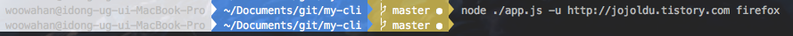
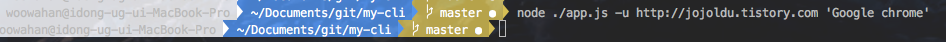
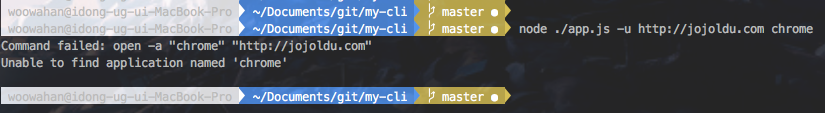
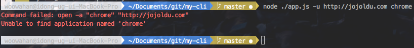
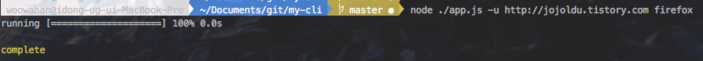

# 나만의 CLI (Command Line Interface) 만들기
마우스로 하는 반복적인 작업이 있을 경우 이를 크게 생각하지 않는 사람이 있고, 이 행동이 귀찮아서 어떻게든 간단하게 해결할 수 있는 방법을 찾는데 더 시간을 쓰는 사람이 있습니다.
이 포스팅은 후자를 위한 이야기입니다.
nodejs를 이용하여 나만의 CLI를 만들어 귀찮은 일들은 전부 스크립트에 맡기자는 주제로 진행할 예정입니다.

### 1. npm init
nodejs 모듈를 만들것이기 때문에
```
npm init
```

### 커맨드 라인 옵션 파싱하기

npm이나 다른 node 모듈들을 사용할 때 보면 여러 옵션을 주면서 스크립트를 실행시키는 것이 기억나시나요? <br/>
이렇게 커맨드라인 입력시 사용되는 옵션을 쉽게 구현하도록 도와주는 모듈가 바로 [commander.js](https://github.com/tj/commander.js)입니다. <br/>
바로 설치와 사용을 해보겠습니다.
```
npm install --save commander
```
그리고 프로젝트 폴더에 app.js 파일을 하나 만들어 보겠습니다. <br/>
현재까지의 프로젝트 구조는 아래와 같습니다.


(폴더구조) <br/>

app.js의 코드는 아래와 같습니다.

```
var commander = require('commander');

commander
    .arguments('<count>')
    .option('-u, --username <username>', 'Your Github name')
    .option('-e, --email <email>', 'Your Email Address')
    .action(function(count){

        for(var i=0;i<count;i++){
            console.log('user: %s, email: %s, print count: %s', commander.username, commander.email, count);
        }

    })
    .parse(process.argv);

```
commander를 사용하는 코드는 이게 끝입니다. 이렇게 간단한 작성만으로 커맨드라인 옵션을 사용할 수 있게 되었습니다. <br/>
```.arguments```는 옵션값 없이 전달 받을 값을 나타냅니다. <br/>
```.option```는 원하는 옵션을 지정하고 해당 옵션으로 전달 받은 값을 스크립트 파일내에서 어떤 이름으로 사용할지를 지정할 수 있습니다. <br/>
```.action```은 값을 입력 받은 후 실행시킬 함수를 지정합니다. <br/>
```.parse```은 어디서 입력을 받는지를 나타냅니다. 여기선 커맨드라인 입력을 사용하기 때문에 ```process.argv```를 할당하였습니다. <br/>

그럼 한번 실행시켜보겠습니다.

```
node ./app.js -u jojoldu -e jojoldu@gmail.com 3
```

결과는!?


멋지게 커맨드라인 옵션이 적용된 것을 볼 수 있습니다. <br/>
```commander```의 경우 help 옵션이 기본으로 추가됩니다.


기본적인 commander 사용법을 익혔으니 본격적인 매인 기능 구현을 진행해보겠습니다.

### 브라우저 열기
마찬가지로 관련된 npm 모듈를 하나 설치하겠습니다. 이번에 사용할 모듈는 [open](https://github.com/pwnall/node-open) 입니다. <br/>
이전처럼 ```npm install```을 이용하여 바로 설치하겠습니다.

```
npm install --save open
```

설치가 되었다면, app.js의 코드를 수정해보겠습니다. <br/>

```
var commander = require('commander');
var open = require('open');

commander
    .arguments('<browser>')
    .option('-u, --url <url>', 'Address of site you want to go to')
    .action(function(browser){
        open(commander.url, browser);
    })
    .parse(process.argv);
```

```open```모듈의 경우 인자값으로 1번째에 url을, 2번째에 브라우저 이름을 사용하면 **해당 브라우저을 실행시켜 지정된 url로 이동**시켜주는 역할을 합니다. <br/>



여기서 함정은 크롬의 경우 어플리케이션 이름이 chrome이 아니라 **Google chrome** 이라서 chrome로는 실행을 시키지 못하고 'Google chrome'로 해야만 합니다.



위와 같이 실행해야만 크롬을 실행시킬 수 있습니다. <br/>
chrome로 실행시켜보시면 그 어떤 변화도 없으면서 관련해서 콘솔에 에러 로그가 나오지 않음을 확인 할 수 있습니다. <br/>
분명히 문제가 있는 것 같은데 문제를 확인할 수 없기 때문에 이런 문제상황에 대한 에러처리를 추가해보겠습니다.

### 에러처리
```open```모듈의 경우 3번째 인자로 콜백(callback)함수를 받을 수 있습니다. <br/>
해당 콜백함수는 open 실행 후, 결과값에 대해 추가로 처리가 필요한 경우 사용하는 함수입니다. <br/>
즉, **에러 발생시 3번째 인자로 전달한 콜백함수에서 에러를 전달 받아 처리**가 가능하다는 것입니다. <br/>
그럼 기존의 app.js를 수정해보겠습니다.

```
var commander = require('commander');
var open = require('open');

commander
    .arguments('<browser>')
    .option('-u, --url <url>', 'Address of site you want to go to')
    .action(function(browser){
        open(commander.url, browser, function (response) {
            if(response instanceof Error){
                console.log(response.message);
            }
        });
    })
    .parse(process.argv);
```
response의 경우 정상적인 결과에도 값이 할당되기 때문에 Error 타입에서만 메세지를 출력할 수 있도록 타입체크를 하였습니다. <br/>
자 이제 이 스크립트에 에러가 발생하도록 다시 실행시켜보겠습니다.



정상적으로 에러메세지가 출력되는 것이 확인되셨나요? <br/>
메세지는 출력되었지만 우리가 기존에 보고 사용했던 다른 node 모듈들과 달리 흑백의 메세지만 출력되었습니다. <br/>
다른 모듈의 경우 에러는 적색으로 강조를 하여 출력되는데 이건 어떻게 한걸까요? <br/>
이번엔 에러 메세지에 컬러 효과를 추가해보겠습니다. <br/>
사용할 모듈의 이름은 [chalk](https://github.com/chalk/chalk)입니다.

```
npm install --save chalk
```

모듈 설치후 app.js의 코드를 아래와 같이 수정하겠습니다.

```
var commander = require('commander');
var open = require('open');
var chalk = require('chalk');

commander
    .arguments('<browser>')
    .option('-u, --url <url>', 'Address of site you want to go to')
    .action(function(browser){
        open(commander.url, browser, function (response) {
            if(response instanceof Error){
                console.log(chalk.red(response.message));
            }
        });
    })
    .parse(process.argv);
```

chalk 모듈의 경우 사용법이 아주 간단합니다. <br/>
```var chalk = require('chalk');```로 모듈 호출 후, ```chalk.red```처럼 원하는 컬러의 속성명을 사용하면 해당 컬러로 문자열이 출력이 됩니다. <br/>
이렇게 해서 다시 실행을 시켜보면!



짜잔! 아주 이쁜 효과로 에러 로그가 출력됨을 확인할 수 있습니다. <br/>
이젠 여기에 좀 더 화려한 효과를 추가해보겠습니다.<br/>

### Progress bar 추가
최근의 node 모듈들을 보면 수행시간이 걸리는 작업에 대해서는 모두 progress bar가 노출되어 수행과정을 보여줍니다. <br/>


우리의 예제에서는 장시간 수행시간이 필요한 작업은 없지만(!?) 자주 사용하는 모듈이기에 한번 사용해보겠습니다. <br/>
사용할 모듈은 [prgress](https://github.com/visionmedia/node-progress)입니다.<br/>
추가할 코드는 다음과 같습니다.

```
var Progress = require('progress'),
    bar = new Progress('running [:bar] :percent :etas', {
        complete: '=',
        incomplete: ' ',
        width: 20,
        total: 1
    });

    ...
    .action(function(browser){
        bar.tick();
        open(commander.url, browser, function (response) {
            if(bar.complete){
                console.log(chalk.yellow('\ncomplete\n'));
            }
    ...
```

progress의 경우 사용하기 위해선 인스턴스 생성이 필요하여 new 키워드를 이용하여 필요한 인자값들을 추가하여 생성하였습니다. <br/>

* ```'running [:bar] :percent :etas'``` : 노출될 progress bar UI를 결정합니다.
  - [:bar] : progress bar
  - :percent : 현재까지 진행된 %
  - :etas : 현재까지 수행된 시간

* 두번째 인자인 객체
  - complete : 진행된 상태에 따라 progress bar에 채울 문자 (디폴트: =)
  - incomplete : 미 진행된 상태에 따라 progress bar에 채울 문자 (디폴트: -)  
  - width : progress bar의 전체 진행 크기 (즉, complete로 채워질 전체 칸 수 정도로 생각하면 됩니다.)
  - total : 완료할 틱의 총 수 (tick이란 단어가 어떤 의미인지 애매하네요. 개인적 생각으론 초 정도로 생각하고 사용중인데 혹시 의견 있으시면 댓글 부탁드립니다!)

전체 app.js의 코드는 아래와 같습니다.
```
var commander = require('commander');
var open = require('open');
var chalk = require('chalk');
var Progress = require('progress'),
    bar = new Progress('running [:bar] :percent :etas', {
        complete: '=',
        incomplete: ' ',
        width: 20,
        total: 1
    });

commander
    .arguments('<browser>')
    .option('-u, --url <url>', 'Address of site you want to go to')
    .action(function(browser){
        bar.tick();
        open(commander.url, browser, function (response) {
            if(bar.complete){
                console.log(chalk.yellow('\ncomplete\n'));
            }

            if(response instanceof Error){
                console.log(chalk.red(response.message));
            }
        });
    })
    .parse(process.argv);
```
이렇게 완성된 코드를 한번 실행시켜보겠습니다.



너무 짧은 수행시간이라 금방 100%가 채워지지만, 다운로드/업로드/파일작성 등 일정 시간이 필요한 작업의 경우에는 진행상태를 볼수있겠죠? <br/>
자 이제 작업은 다되었습니다. 우리의 스크립트를 PC 어디서도 사용할 수 있도록 설치를 해보겠습니다.

### 전역 설치
전역 설치라고 하지만 사실 그 방법은 아주 간단합니다. <br/>
